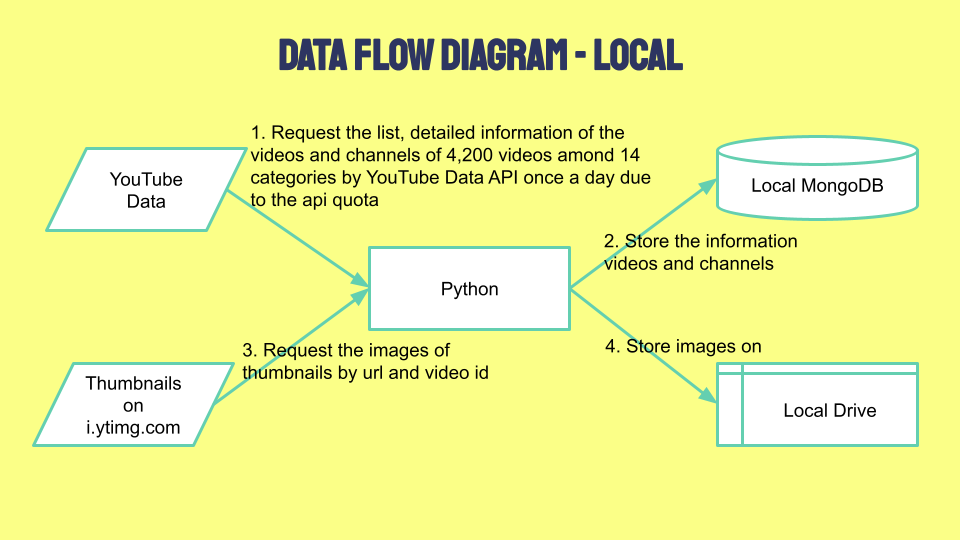
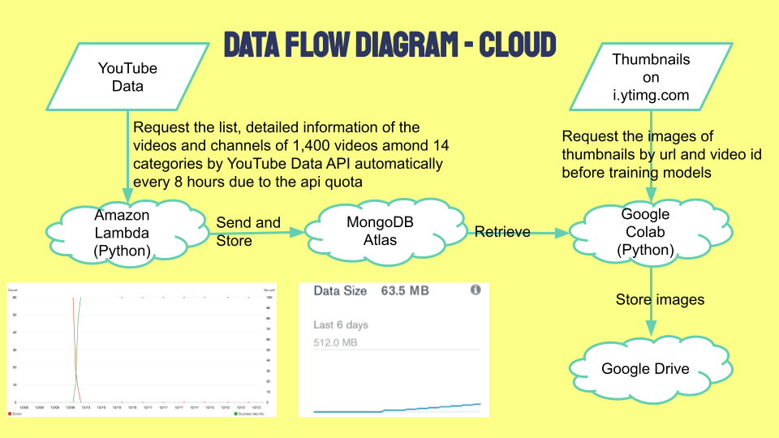

## YouTube Views Prediction
###### Chien Yuan Chang

The goal of this project is to build a data pipeline to ingest the information of YouTube videos by YouTube Data API and store in a database, build a model to predict the views, and deploy a web app for YouTuber creators to estimate the views of their videos and optimize the titles, descriptions, tags, thumbnail, etc.

To start exploring this goal, I tried the process of data ingestion and storage on my local machine first. I used YouTube Data API to search the list of the videos among 14 most common categories and get the detailed information of each video and its channel. The 14 categories were Entertainment, Gaming, Film & Animation, Sports, News & Politics, People & Blogs, Howto & Style, Music, Autos & Vehicles, Education, Travel & Events, Science & Technology, Comedy, and Nonprofits & Activism. With the default quota of YouTube Data API, I was able to get the data of 300 videos per category a day. Then, I requested the images of thumbnails by url and video id and stored the images into my local drive. Below is the data flow with my local machine.

After building the process of data ingestion and storage on my local machine successfully, I tried to transplant the process to cloud. I used Amazon Lambda with EventBridge as trigger to request the list and the detailed information of the videos and channels of 1,400 videos among 14 categories by YouTube Data API automatically every 8 hours and store the data into MongoDB Atlas. Then, I used Google Colab to requested the images of thumbnails by url and video id and stored the images into the Google Drive. Below is the data flow with cloud computing.

By the end of December 12, I was able to have 9,853 unduplicated videos on my local MongoDB and 7,194 unduplicated videos on MongoDB Atlas. I planned to use the data on cloud to train a neural network model with Google Colab and test the data on the local machine.

I used the data on cloud to train some baseline models. Below are the result.

Model|Data Size|MAE|epochs
:---|:---|:---|:---
Neural Network Model with title, images and numerical and categorical features|4,369|67,319|100
Transfer learning with MobilenetV2 by images data|1,000|858,185|100
Linear Regression by title after NLP preprocessing and PCA|2,577|929,794
Linear Regression by tags after NLP preprocessing and PCA|2,577|978,172
Linear Regression by description after NLP preprocessing and PCA|2,577|1,025,251
Linear Regression by title, description and tags after NLP preprocessing and PCA|2,577|1,086,898
Linear Regression by numerical and categorical features|2,577|1,127,231
Linear Regression by images after PCA|2,577|1,127,794
Linear Regression by images and numerical and categorical features|2,577|1,199,496

I will keep monitor the process of data ingestion and storage, try different architecture to optimize the model, and deploy the application on the web by Streamlit or Flask.
